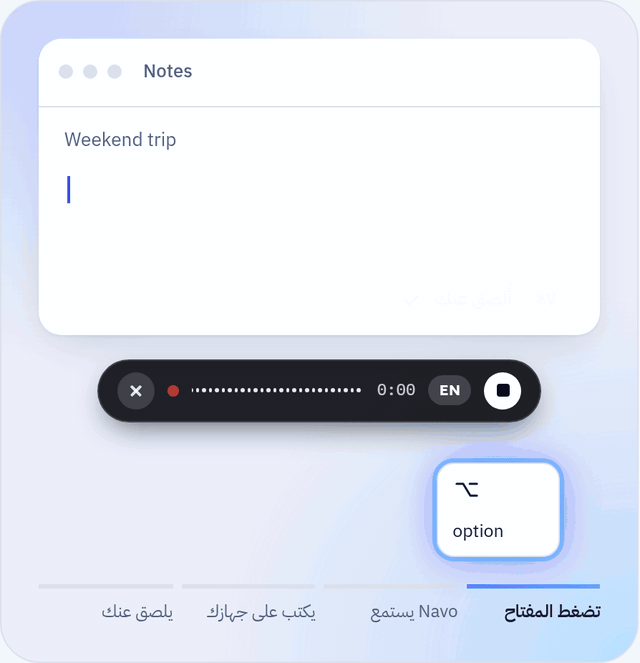

<p align="center"></p>

<h1 align="center">Navo</h1>

<p align="center"><b>تكلّم بدل أن تكتب، بالعربية أو الإنجليزية أو بهما معاً. كل شيء يعمل على جهازك.</b></p>

<p align="center">
  <a href="README.md">English</a> | <a href="README.ar.md"><b>العربية</b></a>
</p>

<p align="center">
  <a href="https://devehab.github.io/STT-NAVO/#ar">الموقع</a> |
  <a href="https://github.com/Devehab/STT-NAVO/releases/latest">تنزيل لنظام Mac</a> |
  <a href="docs/API.md">الـ API المحلي</a>
</p>

<p align="center">
  
  
  
  
</p>

<p align="center"></p>

<div dir="rtl">

Navo لوحة مفاتيح صوتية مفتوحة المصدر لنظام macOS. اضغط مفتاحاً واحداً، تكلّم بشكل طبيعي، ثم ارفع إصبعك، فيلصق Navo النص مرتباً في التطبيق الذي تعمل عليه. التعرف على الصوت يجري على جهازك بنموذج تختاره من أربعة نماذج مفتوحة، والملخصات وإعادة الصياغة تُكتب على جهازك أيضاً. بعد تنزيل النماذج مرة واحدة، لا شيء يغادر حاسوبك.

## المزايا

- **يلصق النص عنك:** ارفع إصبعك فتجد الجملة في التطبيق الذي أمامك. يضع Navo النص في الحافظة، ويضغط Command + V، ثم يعيد إلى الحافظة ما كنت قد نسخته قبل ذلك. حقول كلمات المرور لا يُلصق فيها أبداً.
- **العربية أولاً:** اللهجات والفصحى، والمصطلحات الإنجليزية داخل الجملة العربية. نموذج صغير على جهازك يضبط الترقيم ويحذف الحشو دون ترجمة ودون تغيير لهجتك.
- **تبديل اللغة في ثانية:** Control + Option + L في أي تطبيق، أو زر AR / EN على شريط Flow Bar، حتى في منتصف الجملة.
- **الاجتماعات والنص يظهر مباشرة:** سجّل Google Meet أو Zoom أو أي مكالمة، بصوت الجهاز أو الميكروفون أو الاثنين. يظهر النص أثناء الاجتماع، ولا يُقطع الصوت إلا عند لحظات الصمت.
- **ملخصات وإعادة صياغة على جهازك:** زر AI يكتب ملخصاً فيه القرارات والمهام، أو يعيد صياغة النص كبريد رسمي أو ودّي أو رسالة قصيرة أو مسودة مرتبة، بالعربية أو الإنجليزية. يكتبه Gemma 4 أو Llama 3.1 دون حساب ودون إنترنت.
- **ملفات صوتية من أي جهاز:** تسجيلات Voice Memos ورسائل واتساب الصوتية وملفات MP3 و M4A و WAV و FLAC، مع بحث في العناوين والنص وفلتر للتاريخ.
- **سجل الحافظة واللصق السريع:** Control + Option + V يفتح آخر ما نسخته في أي تطبيق. اكتب للبحث ثم Return للصق. وما تنسخه على iPhone يصل أيضاً عند تفعيل Universal Clipboard.
- **خفيف على الذاكرة:** تُحمَّل النماذج عندما تتكلم وتخرج من الذاكرة بعد مدة خمول تختارها (2 أو 5 أو 10 أو 30 أو 60 دقيقة). في السكون يأخذ المحرك بضع عشرات من الميغابايت فقط. نموذج الصوت ونموذج اللغة لا يُحمَّلان معاً، وكل نموذج لغة يبقى تحت 6 غيغابايت.
- **خصوصية كاملة:** لا سحابة، لا حساب، ولا تتبع. المحرك يستمع على العنوان 127.0.0.1 فقط. أطفئ Wi-Fi وجرّب الإملاء: سيعمل.

## النماذج

| النموذج | الجهة | الأنسب لـ | التنزيل | Token |
| --- | --- | --- | --- | --- |
| Audar ASR V1 Turbo | AudarAI | اللهجات العربية والعربية المخلوطة بالإنجليزية، يُثبَّت تلقائياً | 4.7 GB | غير مطلوب |
| Cohere Transcribe Arabic | Cohere Labs | العربية الفصحى واللهجات، والإنجليزية | 4.1 GB | مطلوب، مجاني |
| Whisper Large v3 Turbo | OpenAI | الإنجليزية ونحو 100 لغة، الأخف | 1.6 GB | غير مطلوب |
| Qwen3-ASR 1.7B | Qwen, Alibaba | الإنجليزية و30 لغة | 4.1 GB | غير مطلوب |
| Gemma 4 E4B | Google | الملخصات وإعادة الصياغة، الأفضل للعربية | 5.2 GB | غير مطلوب |
| Llama 3.1 8B | Meta | الملخصات وإعادة الصياغة، قوي في الإنجليزية | 4.5 GB | غير مطلوب |
| Qwen3 4B | Qwen, Alibaba | ترتيب كل إملاء، يُثبَّت تلقائياً | 2.3 GB | غير مطلوب |

يمكن تشغيل نموذجين للصوت في الوقت نفسه: واحد للإملاء، وآخر للاجتماعات والملفات أو للـ API.

## المتطلبات

- Mac بمعالج Apple Silicon (M1 أو أحدث). أجهزة Intel غير مدعومة.
- macOS 14 أو أحدث (و14.4 أو أحدث لتسجيل صوت الجهاز في الاجتماعات).
- ذاكرة 8 غيغابايت على الأقل، ويُنصح بـ 16 غيغابايت. على 8 غيغابايت شغّل نموذج صوت واحداً، و Whisper هو الأخف.
- نحو 8 غيغابايت من مساحة القرص للإعداد الأول، ثم حجم كل نموذج إضافي.
- اتصال بالإنترنت للتنزيل الأول فقط.
- Token من Hugging Face لنموذج Cohere فقط (حساب مجاني و Token من نوع Read).

## التثبيت

1. نزّل ملف DMG من [آخر إصدار](https://github.com/Devehab/STT-NAVO/releases/latest)، افتحه، واسحب Navo إلى مجلد Applications.
2. افتح Navo. إن قال macOS إنه لا يستطيع التحقق من التطبيق، افتح System Settings ثم Privacy & Security واضغط Open Anyway بجانب Navo. مرة واحدة فقط.
3. في الإعدادات تعرض قائمة Setup كل خطوة. اضغط Install: ينزّل Python و MLX ونموذج صوت ونموذج الترتيب الصغير، نحو 7 غيغابايت ولمرة واحدة. دون Token يُثبَّت Audar.
4. اختياري، لنموذج Cohere: وافق على شروط النموذج في Hugging Face، أنشئ Token من نوع Read من [huggingface.co/settings/tokens](https://huggingface.co/settings/tokens)، الصقه في الإعدادات واضغط Download بجانب Cohere.
5. اختياري، للملخصات: اضغط Download Gemma في قائمة Setup (5.2 غيغابايت).
6. اسمح بالميكروفون و Accessibility عندما يطلبهما Navo.
7. عندما يظهر Local engine: Ready، انقر داخل أي حقل نص، اضغط مطولاً على Right Option، تكلّم، ثم ارفع إصبعك.

## الاختصارات

| الاختصار | ماذا يفعل |
| --- | --- |
| ضغط مطوّل على Right Option | الإملاء ما دام المفتاح مضغوطاً |
| نقرتان على Right Option | الإملاء دون ضغط مستمر، ونقرة أخرى للإنهاء |
| Esc | إلغاء الإملاء |
| Control + Option + L | التبديل بين العربية والإنجليزية |
| Control + Option + V | اللصق السريع من سجل الحافظة |

مفتاح الإملاء والاختصاران يمكن تغييرها من الإعدادات.

## للمطورين

المحرك يوفر API متوافقاً مع OpenAI على العنوان `http://127.0.0.1:7861`، والتوثيق في [docs/API.md](docs/API.md) و [docs/API-LLM.md](docs/API-LLM.md).

</div>

```bash
./scripts/run.sh          # البناء من المصدر والتشغيل
bash scripts/package.sh   # إنشاء ملف DMG في مجلد dist
```

<div dir="rtl">

التفاصيل الكاملة (البناء، الخصوصية، حل المشكلات) في [النسخة الإنجليزية](README.md).

## الرخصة

رخصة MIT. النماذج من Cohere Labs و AudarAI و OpenAI و Qwen و Google و Meta، كل منها برخصته المذكورة في [README.md](README.md#credits).

</div>
