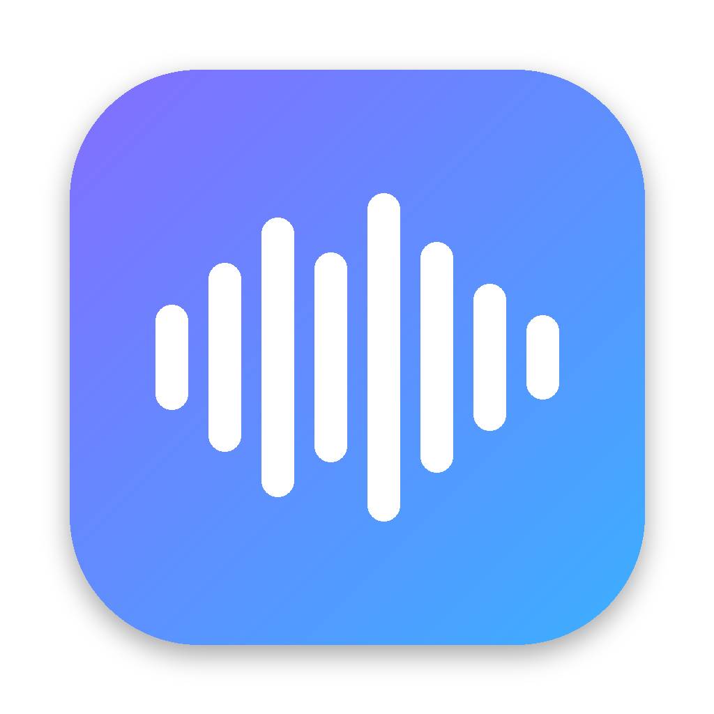
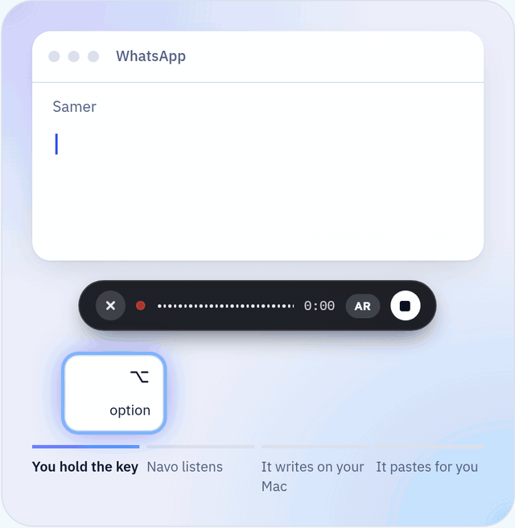

<p align="center"></p>

<h1 align="center">Navo</h1>

<p align="center"><b>Talk instead of typing, in Arabic, English, or both. Fully local on your Mac.</b></p>

<p align="center">
  <a href="README.md"><b>English</b></a> | <a href="README.ar.md">العربية</a>
</p>

<p align="center">
  <a href="https://devehab.github.io/STT-NAVO/">Website</a> |
  <a href="https://github.com/Devehab/STT-NAVO/releases/latest">Download for Mac</a> |
  <a href="#install">Install</a> |
  <a href="docs/API.md">Local API</a>
</p>

<p align="center">
  
  
  
  
</p>

<p align="center"></p>

Navo is an open source voice keyboard for macOS in the spirit of Wispr Flow. Hold a key, speak naturally, let go, and Navo pastes clean text into whatever app you are typing in. Speech recognition runs on your Mac with your choice of four open models: two for Arabic, **Cohere Transcribe Arabic** and **Audar ASR V1 Turbo**, and two multilingual ones that are strongest in English, **Whisper Large v3 Turbo** and **Qwen3-ASR 1.7B**. A small local model tidies each transcript, and summaries and rewrites are written on your Mac too, by **Gemma 4** (Google) or **Llama 3.1** (Meta). After a one-time model download, nothing leaves your computer.

| | |
| --- | --- |
| **Pastes for you** | The text goes straight into the focused app, and your clipboard is put back the way it was |
| **Arabic first** | Dialects, Modern Standard, and English terms inside Arabic sentences |
| **Meetings** | Live transcript while the call goes on, then a summary with decisions and action items |
| **Files** | Voice Memos, WhatsApp voice notes, MP3, M4A, WAV, FLAC, with search and a date filter |
| **Clipboard history** | Control + Option + V opens your last copies in any app |
| **Light on memory** | Models load when you talk and leave after the idle time you choose |
| **Private** | No cloud, no account, no tracking. The engine listens on 127.0.0.1 only |

## Features

- **Push to talk anywhere**: hold Right ⌥ (configurable: Right ⌘, Right ⌃, fn), release to insert. Double-tap for hands-free, tap again to finish, Esc to cancel.
- **Arabic first**: MSA, dialects and Arabic-English code-switching. Cleanup keeps your dialect and never translates.
- **Switch the language in a second**: press Control + Option + L in any app (or record your own shortcut in Settings), use the switch on Home or the AR / EN button on the Flow Bar, even while you talk. Cohere takes Arabic or English; Audar, Whisper and Qwen3 also have Auto, where the model detects the language itself (Audar always picks up the Arabic dialect from the audio).
- **Four speech engines, two on at a time**: Cohere Transcribe Arabic and Audar ASR V1 Turbo for Arabic dialects, Whisper Large v3 Turbo (100 languages, fast, 1.6 GB) and Qwen3-ASR 1.7B (30 languages) for English and other languages. Pick one for dictation and keep one more on for meetings, files or other apps through the API. Each model takes 1.6 to 4.7 GB while loaded, so a third can be turned on once one of the two is off.
- **Compare engines**: run any recording or audio file through the two engines that are on and see both transcripts side by side, in the app or with one API call.
- **Record tab, for meetings, with live text**: record a Google Meet, Zoom or any call with what your Mac plays, your microphone, or both. The text appears while the meeting goes on: every minute or so (30 seconds to 5 minutes, your choice) the newest piece is cut at a pause and transcribed by the engine you choose. Pause and resume; the audio is saved to disk in parts every 3 or 5 minutes, so a crash loses at most the last part, and becomes one recording when you stop.
- **Cuts that never split a word**: long audio is only ever cut inside a real pause. Navo looks up to 10 seconds before and after each target point for a stretch where nobody speaks (at least 300 ms, measured against the background noise around it), prefers the longest and cleanest one, and cuts in its middle. Silent pieces are not sent at all, so the models cannot invent text for them. The engine uses the same method to fit pieces into each model.
- **Find any recording**: Record and Files have a search field that looks in titles and in the text itself (Arabic without caring about diacritics or hamza forms), shows the line where the words were found, and a date filter: today, yesterday, the last 7 or 30 days, or one day picked from a calendar.
- **Files tab, for audio from other devices**: Voice Memos recordings come in with Share > Navo, or ⌘C in Voice Memos and Paste in Navo, or Open With > Navo in Finder, or a drop. WAV, MP3, AAC, FLAC and WhatsApp voice notes (OGG, Opus) work too. The text appears piece by piece while the engine works through a long recording, with times if you want them, to copy or export. Files added while one is being transcribed wait their turn, so each finishes as fast as it can.
- **Progress in the menu bar**: while a long recording or file is being transcribed, the Navo icon fills up like a pie with the percentage beside it; during a meeting it shows a red dot and the time. When everything is done it turns into a green check mark (orange if some of it could not be transcribed), so you can tell from across the room. The menu lists each transcription with how far it is; click one to open it.
- **AI summaries and rewrites, on this Mac**: the AI button on any dictation, meeting or file makes a summary or a detailed summary (points, decisions, action items, names and numbers, in the text's language, English or Arabic), or rewrites it as a formal email, a friendly email, a casual text message or a clean rewrite, in English (natural American) or Arabic (Modern Standard for emails, everyday Levantine for messages and rewrites), whatever language the text is in. An open language model on your Mac writes it, Gemma 4 E4B or Llama 3.1 8B, and you watch the answer appear as it is written. No account, no API key, no internet: the text never leaves the Mac. A long meeting is read in parts, so even an hour of talk fits.
- **Light on memory, by design**: a language model and a speech model are never loaded together. Ask for a summary and the speech models step out, the language model loads, writes, and leaves when you close the panel; the speech model is back the next time you dictate. A recording that is running keeps recording, and its live text waits for the summary to finish. Each language model stays under 6 GB, so it all works on a 16 GB Mac with other apps open.
- **Quick paste, like Spotlight**: press Control + Option + V in any app (or your own shortcut) and a small panel opens in the middle of the screen with your last 10 copies and a preview of each. Type to search everything kept, then Return, a click or ⌘1 to ⌘0 pastes it where you were working; ⌘Return only copies it. The app you work in keeps its focus the whole time.
- **Clipboard tab**: the text you copy in any app, kept on your Mac so you can find it and copy it again. Search, star what you want to keep forever, and choose how long the rest stays (1 day to 2 months). Password managers' copies are never kept, and it can be turned off in Settings.
- **Memory only while it works**: models load when you start talking and leave memory after 10 idle minutes (configurable), so the engine sleeps at a few dozen MB instead of several GB.
- **Flow Bar**: a tiny bubble on the edge of the screen. Bring the pointer close and it opens (Speak, language, History, Settings). While you talk it shows a live waveform, a timer and the language. Drag it to the bottom, left or right edge of any display.
- **Hub**: every dictation saved in SQLite, grouped by day, with search (diacritic and hamza insensitive for Arabic), copy, edit, play the recording, show the original transcript, re-transcribe, delete, plus stats (total words, wpm, streak, minutes saved).
- **Dictionary**: names and terms that guide the cleanup model, plus exact replacements.
- **Never loses a dictation**: if transcription fails the audio stays in History with a Retry button; if cleanup fails the raw transcript is inserted.
- **Clipboard safe**: pastes with ⌘V, then restores what was on your clipboard.

## How it works

```
Hold key ─► AVAudioEngine (16 kHz mono) ─► WAV
                                            │
                     Navo engine on 127.0.0.1:7861 (Python, started by the app)
                                            │
          Cohere, Audar, Whisper or Qwen3-ASR (MLX) ─► raw transcript
                                            │
          Local LLM cleanup (Qwen3 4B via MLX) ─► clean text
                                            │
          Clipboard + ⌘V into the focused app ─► SQLite history

AI button ─► the speech models leave memory ─► Gemma 4 or Llama 3.1 (MLX) ─► summary or rewrite
```

The engine is two processes: a small gateway that always listens on 7861, and a models process that the gateway starts when a model is needed and stops after the idle time. Navo wakes it the moment you start talking, so the model loads while you speak.

The macOS app is native Swift (SwiftUI + AppKit). The engine is a small FastAPI server with OpenAI-compatible endpoints (`/cohere/v1/audio/transcriptions`, `/audar/v1/audio/transcriptions`, `/whisper/v1/audio/transcriptions`, `/qwen3/v1/audio/transcriptions`, `/v1/audio/compare`, `/gemma/v1/chat/completions`, `/llama/v1/chat/completions`, `/v1/chat/completions`, `/health`), so you can also point cleanup at Ollama or LM Studio.

## Install

1. Download **Navo-<version>.dmg** from the [latest release](https://github.com/Devehab/STT-NAVO/releases/latest), open it and drag **Navo** into **Applications**.
2. Open Navo from Applications. If macOS says it can't check Navo for malicious software, open **System Settings > Privacy & Security**, scroll down and click **Open Anyway** next to Navo, then confirm. You do this once. (A build signed with an Apple Developer ID and notarized opens with no warning at all, see [Make the download](#make-the-download).)
3. Navo opens its Settings. The **Setup** list at the top shows what Navo needs, step by step, and what is already on your Mac. Click **Install**: it downloads Python, MLX, the speech model for dictation and the small cleanup model (about 7 GB, one time), then works offline. No account is needed: without a Hugging Face token Navo installs **Audar**. For **Cohere** too, accept its terms at [huggingface.co/CohereLabs/cohere-transcribe-arabic-07-2026](https://huggingface.co/CohereLabs/cohere-transcribe-arabic-07-2026), create a **Read** token at [huggingface.co/settings/tokens](https://huggingface.co/settings/tokens), paste it in Settings and click **Download** next to Cohere. **Whisper** and **Qwen3** are public like Audar: click **Download** next to them, no token needed.
4. Optional, for summaries and rewrites: click **Download Gemma** in the Setup list (5.2 GB, no token). **Models on this Mac** in the same place lists all seven models with their size, what each is for, which one is required, and whether it is downloaded.
5. Allow **Microphone** and **Accessibility** when Navo asks (Settings shows both).
6. When the sidebar says **Local engine: Ready**, click into any text field, hold **Right ⌥**, talk, release.

To update, drag the new version into Applications and replace the old one. Your history, recordings and models stay. If the new version is signed differently, macOS asks for Accessibility and Microphone once more.

## Requirements

- Apple Silicon Mac (M1 or newer), macOS 14 or later. 8 GB RAM at least (one speech model, Whisper is the lightest), 16 GB recommended, 24 GB or more to keep two speech engines loaded at once
- About 8 GB free disk space, plus the size of each other model you download. Speech: Whisper about 1.6 GB, Qwen3 about 4.1 GB, Cohere about 4.1 GB, Audar about 4.7 GB. AI writing: Gemma about 5.2 GB, Llama about 4.5 GB
- An internet connection for the one-time engine install
- To build from source: Xcode or the Command Line Tools (`xcode-select --install`)

## Build from source

```bash
./scripts/run.sh
```

`run.sh` builds `Navo.app`, installs it to `~/Applications`, installs the local engine on the first run (uv, Python 3.12, MLX, PyTorch, the speech model and the cleanup model), and launches Navo. On the first run it asks for your Hugging Face token once (or put `HF_TOKEN=...` in a `.env` file, see `.env.example`). Then:

1. Allow **Microphone** and **Accessibility** when Navo asks (Settings shows both).
2. Wait for the sidebar to say **Local engine: Ready**.
3. Click into any text field, hold **Right ⌥**, talk, release.

You can also install or reinstall the engine from Navo > Settings > Speech engines. To add Audar, Whisper or Qwen3, click **Download** next to it there, then **Use for dictation** if you want it to transcribe what you dictate. Two engines can be on at once: turn one off to turn another on.

## Make the download

```bash
bash scripts/package.sh
```

builds Navo and makes `dist/Navo-<version>.dmg` (with its SHA-256 next to it): a disk image with Navo, a link to Applications and a window that shows people to drag Navo in. Share that file; it holds everything, including the engine installer. macOS may ask once to let Terminal control Finder, which lays out the window.

Without an Apple Developer ID, people allow Navo once on the first open (step 2 of [Install](#install)); the disk image window says how. With one (Apple Developer Program), the download opens on any Mac with no warning:

```bash
# once: store your notary login in the keychain
xcrun notarytool store-credentials navo --apple-id you@example.com --team-id TEAMID
# every release
NAVO_SIGN_IDENTITY="Developer ID Application: Your Name (TEAMID)" NAVO_NOTARY_PROFILE=navo \
  bash scripts/package.sh
```

This signs Navo with the hardened runtime, sends the disk image to Apple for notarization, and attaches the result so it opens even offline.

## Use the engine from other tools

The local engine is an OpenAI-compatible HTTP API on `http://127.0.0.1:7861`: send audio, get text back. Scripts, plugins and agents can use it while Navo is running.

| Engine | Base URL | Documentation |
| --- | --- | --- |
| Cohere Transcribe Arabic | `http://127.0.0.1:7861/cohere/v1` | [docs/API-Cohere.md](docs/API-Cohere.md) |
| Audar ASR V1 Turbo | `http://127.0.0.1:7861/audar/v1` | [docs/API-Audar.md](docs/API-Audar.md) |
| Whisper Large v3 Turbo | `http://127.0.0.1:7861/whisper/v1` | [docs/API-Whisper.md](docs/API-Whisper.md) |
| Qwen3-ASR 1.7B | `http://127.0.0.1:7861/qwen3/v1` | [docs/API-Qwen3.md](docs/API-Qwen3.md) |
| Gemma 4 E4B (language model) | `http://127.0.0.1:7861/gemma/v1` | [docs/API-LLM.md](docs/API-LLM.md) |
| Llama 3.1 8B (language model) | `http://127.0.0.1:7861/llama/v1` | [docs/API-LLM.md](docs/API-LLM.md) |

[docs/API.md](docs/API.md) covers what they share: turning engines on and off (two at most at once, a third answers `409`), the languages each takes, `POST /v1/audio/compare` for the transcripts of one file side by side, the cleanup LLM and agent tools. [docs/API-LLM.md](docs/API-LLM.md) covers the language models: the system prompt, the text and the response, streaming, the memory rules (asleep until a request wakes them, never loaded with a speech model, at most 6 GB) and long texts. [`examples/api`](examples/api) has ready clients in Python (`transcribe.py`, `compare.py`, `chat.py`), Node and the OpenAI SDK.

## Development

```bash
bash scripts/build-app.sh debug    # build/Navo.app with swiftc (log in build/build.log)
open Package.swift                 # or work in Xcode through the Swift package

cd engine && python -m pytest -q   # engine tests, no model needed

bash scripts/demo.sh               # open Navo on made-up sample data, for screenshots and demos
bash scripts/publish.sh            # commit and push to GitHub, and turn on the website
```

`demo.sh` starts Navo with `--demo`: the history, the recordings and the clipboard come from a folder of sample data (`~/Library/Application Support/Navo/Demo`, filled again on every start), your own data is not shown or touched, and the clipboard is not read. Quit Navo and open it normally to go back.

The website is one file, [docs/index.html](docs/index.html), in English and Arabic (it follows the visitor's browser language), with its fonts in `docs/fonts` and its pictures in `docs/screenshots`. It is published with GitHub Pages from the `docs` folder at [devehab.github.io/STT-NAVO](https://devehab.github.io/STT-NAVO/). The download link and the repository address are in the `NAVO` block at the top of its script.

Run the engine by hand (for example to try another model):

```bash
PYTHONPATH=engine ~/Library/Application\ Support/Navo/engine/venv/bin/python -m navo_engine --port 7861 --engines cohere,audar
curl -F file=@sample.wav -F language=ar http://127.0.0.1:7861/audar/v1/audio/transcriptions
```

If you have an Apple Development certificate, `build-app.sh` signs with it so macOS keeps the Accessibility permission across rebuilds. With ad-hoc signing, remove Navo from System Settings > Privacy & Security > Accessibility and add it again after a rebuild.

## Project layout

```
Sources/Navo/
  App/        AppDelegate (menu bar, lifecycle), MenuBarActivity (transcription progress in the menu bar), AppSettings, DictationController (the pipeline)
  Audio/      AudioRecorder (dictation), microphone and Mac audio capture (Core Audio tap), WAV files
  Input/      HotkeyManager (push-to-talk, Esc), GlobalShortcut (language switch), TextInjector (paste, clipboard restore)
  Engine/     SpeechEngine (Cohere, Audar, Whisper, Qwen3), WritingModel (Gemma, Llama), LocalEngineManager
              (install, download, launch, engines on and off), HTTP clients, CleanupService
  AI/         AIWriter (summaries and rewrites with the local language models), the prompts, long texts in parts
  FlowBar/    Floating edge bubble: panel, layout, SwiftUI views
  Hub/        Main window: Home (stats, history), Record, Files, Clipboard, Dictionary, Settings (with the
              Setup list and the models table), Compare engines, the AI panel
  Sessions/   Meeting recorder (parts on disk, mixing, live pieces), SmartCut and PieceCutter (cuts at pauses),
              audio decoding, pasted and dropped audio, SessionStore (transcription jobs), SessionFilter
              (search and dates)
  Clipboard/  ClipboardStore (clipboard history), QuickPaste (the Spotlight style panel of recent copies)
  Storage/    SQLite database, HistoryStore
  Support/    Paths, Arabic-aware text tools
Extensions/NavoShare/  "Navo" in the Share menu (a sandboxed share extension that hands audio to the app)
engine/
  navo_engine/  FastAPI server, engines (Cohere, Audar, Whisper, Qwen3), ASR backends (MLX, transformers), splitting at
                pauses, language models (Gemma, Llama) and their memory rules, cleanup LLM, model download
  setup-engine.sh, requirements.txt, tests/
scripts/      build-app.sh, run.sh, package.sh (the DMG download), demo.sh (sample data)
```

## Data and privacy

Everything lives in `~/Library/Application Support/Navo`: `navo.sqlite` (history, dictionary, meetings and files, clipboard history), `Audio/` (dictation recordings), `Sessions/` (meetings and imported files), `Inbox/` (audio from the Share menu, moved into Files right away), `engine/` (Python environment), `Logs/engine.log`. Models are in the Hugging Face cache (`~/.cache/huggingface`). The engine listens on 127.0.0.1 only and loads models with `HF_HUB_OFFLINE=1`.

- **Recordings** are kept as WAV files by default so you can replay or re-transcribe them. Turn off *Keep recordings* and each one is erased right after transcription, or set *Keep recordings for* to a number of days.
- **Deleting is permanent.** Recordings are removed from disk (not moved to the Trash). The database runs with `secure_delete`, so deleted text is overwritten, and it is compacted after every deletion.
- **Memory**: Settings > Speech engines > *Free memory when idle* (2 minutes to 1 hour, or never) and *Free memory now*. Asleep, the engine uses a few dozen MB; the first dictation after a sleep takes a few seconds longer.
- **Delete history** (Settings) removes everything except the last N days, only the last N days, or everything, for text and recordings or recordings only. *Keep text for* does the same automatically every hour.
- **Clipboard history** keeps plain text only, for the time you choose (starred items until you delete them), at most the newest 5,000 items and 20 million characters. Anything marked concealed or transient (password managers do this) and copies from password manager apps are skipped. Deleting is permanent, like everything else.
- **AI writing stays on this Mac too.** Summaries and rewrites are written by Gemma or Llama inside the local engine. No text, no audio and no key goes anywhere, and it works with Wi-Fi off. Answers are kept in memory while Navo runs and are not saved. (Earlier versions used Google Gemini for this; a key saved back then is erased from your keychain the first time this version runs.)
- **The only time Navo uses the internet** is to download the engine and the models you choose, once, from PyPI and Hugging Face.

## Verify it runs locally

- Turn Wi-Fi off and dictate. It still works.
- Settings > *Proof it runs on this Mac* shows the device (Apple GPU via MLX), the address (127.0.0.1 only), offline mode, engine memory, model sizes on disk and how long the last transcription took. Every history entry shows *On this Mac, MLX* and its processing time.
- From the Terminal:

```bash
curl -s http://127.0.0.1:7861/health | python3 -m json.tool
ps -o pid,rss,%cpu,command -p $(pgrep -d, -f navo_engine)   # the gateway, plus the models process while awake
lsof -nP -iTCP -sTCP:LISTEN | grep 7861
```

## Troubleshooting

| Problem | Fix |
| --- | --- |
| The key does nothing | Allow Accessibility for Navo, then wait two seconds (Navo re-arms the key automatically). |
| Text is copied but not pasted | Same: Accessibility is required to send ⌘V. Password fields are never auto-pasted. |
| fn opens the emoji picker | System Settings > Keyboard > "Press 🌐 key to" > Do Nothing, or use Right ⌥. |
| Install says access refused | Accept the model terms on Hugging Face with the account that owns the token. |
| Engine shows Error | Settings > Engine log. For Cohere, MLX failures fall back to PyTorch automatically. |
| The AI panel says a model is not downloaded | Click Download there, or in Settings > AI writing. Gemma is 5.2 GB, Llama 4.5 GB, no token needed. |
| Gemma says the model type is not supported | The engine was installed before Gemma 4 existed. Settings > Speech engines > Reinstall / update; the models you have are kept. |
| Dictation is slower right after a summary | The speech model had stepped out of memory for the language model and loads again, a few seconds. Closing the AI panel frees the language model at once. |
| Audar says Not downloaded | Settings > Speech engines > Download next to Audar. No token is needed. |
| The Mac feels slow with two engines on | Lower *Free memory when idle*, or turn off the engine you do not use for dictation, in Settings > Speech engines. |
| An engine's switch is greyed out | Two engines are on already, and that is the most at once. Turn one of them off, then turn this one on. |
| Record shows no sound from the Mac | System Settings > Privacy & Security > Screen & System Audio Recording > System Audio Recording Only: allow Navo, then start the recording again. Needs macOS 14.4 or later. |
| The first dictation after a pause is slower | The models were asleep and loaded again. Raise *Free memory when idle*, or set it to Never. |
| Navo is not in the Share menu | Run `./scripts/run.sh` once (it registers the extension), then System Settings > General > Login Items & Extensions > Sharing (on macOS 14: Privacy & Security > Extensions > Sharing): turn Navo on. In the Share menu, Edit Extensions shows it too. |
| Paste says there is no audio | The message lists what the clipboard holds. Use Share > Navo in Voice Memos instead, or drag the recording to Finder and then onto Files. |
| English comes out in Arabic letters | Switch the language to English (Control + Option + L, the switch on Home, or the AR / EN button), or use Auto. For English, Whisper or Qwen3 usually does best. |
| The language shortcut does nothing | Settings > Language says when another app already uses it. Click the shortcut there and press a new one. |

## Credits

- [Cohere Transcribe Arabic](https://huggingface.co/CohereLabs/cohere-transcribe-arabic-07-2026) by Cohere Labs, Apache 2.0
- [Audar ASR V1 Turbo](https://huggingface.co/audarai/Audar-ASR-V1-Turbo) by AudarAI, AudarAI Community License v1.0
- [Whisper Large v3 Turbo](https://huggingface.co/openai/whisper-large-v3-turbo) by OpenAI, MIT, in [mlx-community's MLX build](https://huggingface.co/mlx-community/whisper-large-v3-turbo-asr-fp16)
- [Qwen3-ASR 1.7B](https://huggingface.co/Qwen/Qwen3-ASR-1.7B) by the Qwen team at Alibaba, Apache 2.0, in [mlx-community's MLX build](https://huggingface.co/mlx-community/Qwen3-ASR-1.7B-bf16)
- [Gemma 4 E4B](https://huggingface.co/google/gemma-4-E4B-it) by Google, Apache 2.0, in [mlx-community's 4 bit MLX build](https://huggingface.co/mlx-community/gemma-4-e4b-it-4bit)
- [Llama 3.1 8B Instruct](https://huggingface.co/meta-llama/Llama-3.1-8B-Instruct) by Meta, Llama 3.1 Community License, in [mlx-community's 4 bit MLX build](https://huggingface.co/mlx-community/Meta-Llama-3.1-8B-Instruct-4bit)
- [mlx-audio](https://github.com/Blaizzy/mlx-audio) and [mlx-lm](https://github.com/ml-explore/mlx-lm) for Apple Silicon inference
- Inspired by Wispr Flow

MIT License.
